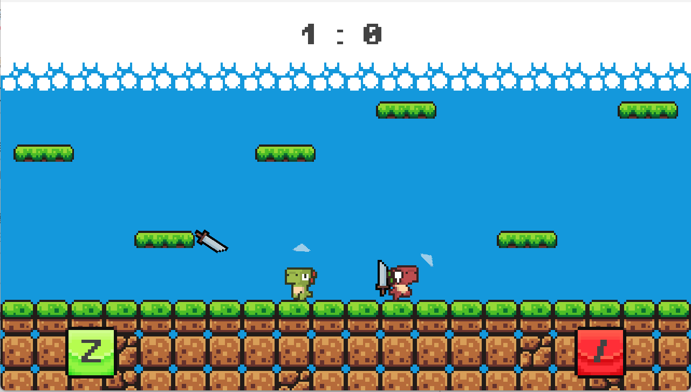

# Overview
One-Button-Dino is a 2-player casual game salute to the Micro Battles series made by [Donut Games](https://www.donutgames.com/). Made with Godot 4 and C#.
## How to play
* Each player has only one button to control: Z and slash (/ and ?), respectively. When you click the button, you will throw the sword when holding one, or jump when nothing is in hand.
  
    
* When you hurt by the sword, your opponent will get one score. Try to win more points!
  
    
## Resources
* The tilemap, SFX and BGM are from the [Brackeys' bundle](https://brackeysgames.itch.io/brackeys-platformer-bundle);
* The dino characters are from the [Arks' bundle](https://arks.itch.io/dino-characters).
  
Thanks a lot to these open access resources!
